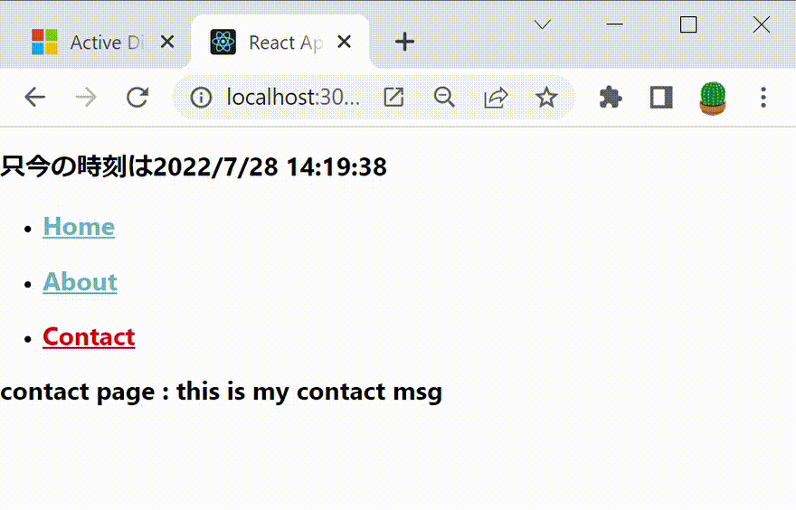
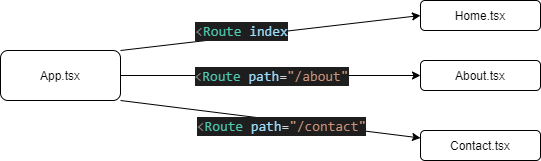

# Reactでの画面遷移

React Routerの使い方 (画面遷移の基礎)
https://reactrouter.com/docs/en/v6/getting-started/tutorial
軽く理解しておく

## 参考サイト

https://reffect.co.jp/react/react-router-6
公式のDocumentも良いが、このサイト情報がすごいしっかり纏められている。

## リンク・フック
Link, NavLink, Navigate, useNavigate　などいろいろある。

hookいろいろ
useLocation, useLocation, useSearchParams, useLocation, 
useState, useReducer

## まとめ
しばらく触ってイメージとしては下記の図のようになる。

AdminLTEにあててみるかな。
