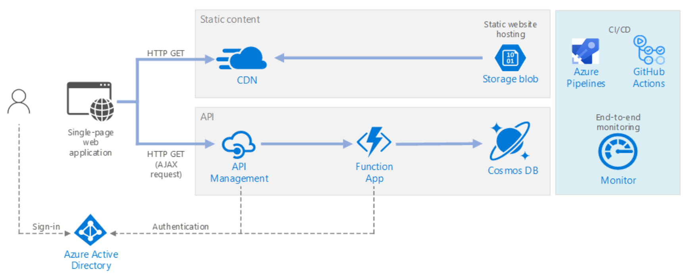
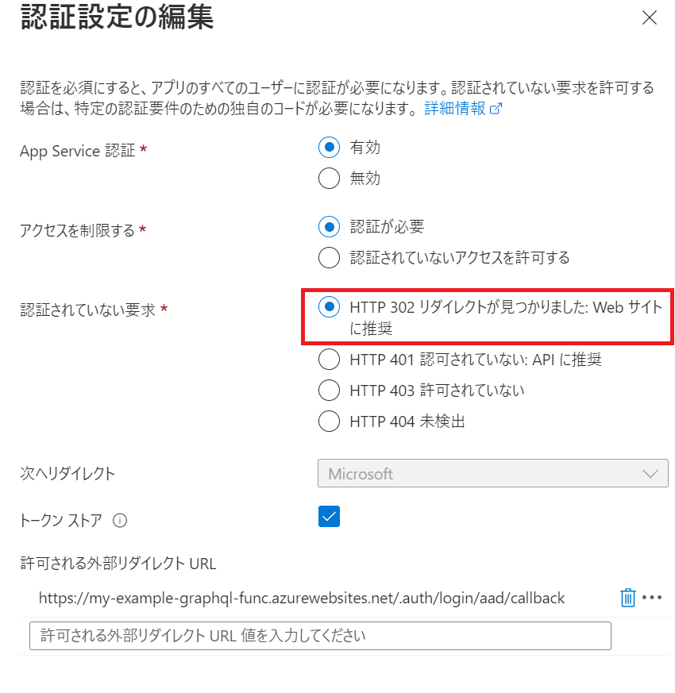

# React + GraphQL

# GraphQLとは

クライアントに公開するエンドポイントを１つにして、Queryで処理を分ける。


(特徴)
クライアントが宣言型の方法でサーバーにデータを要求する  
データ スキーマの変更は、API のスキーマ定義でクライアントによって行われる  
データを提供するために複数の API 要求を必要とする一般的な REST API と対照的
  
GraphQL プロバイダー としてApollo が有名

構文 (Query と Mutation)
| CRUD | Query/Mutation| query のサンプル |
| --- | --- | --- |
| get  | Query | { getMessages{id, author, ... <br> { getMessage|
| create | Mutation | mutation{ createMessage( ... |
| update | Mutation | mutation{ updateMessage( ... |
| delete | Mutation | mutation{ deleteMessage( ... |

(RESTFull APIと比較して説明するとより分かりやすいかも)
RESTFull API では 基本的にAPIをリソース毎に定義する
graphql では APIは一つでクライアントがQueryで要求内容を指定する

https://hasura.io/learn/ja/graphql/intro-graphql/graphql-vs-rest/

https://www.redhat.com/ja/topics/api/what-is-graphql


既存の REST API 上に導入して、既存の API 管理ツールと連携可能

(メリット)
・過剰取得の回避
・API呼び出し頻度の抑制
・API開発者とのやり取りの簡略化
・セルフドキュメンテーション

(デメリット)
データクエリ処理の多くがサーバーサイドに移行されるので、サーバー開発者の作業が複雑になる
キャッシュが REST よりも複雑
レート制限や価格設定を考慮する場合、REST API とは異なる API 管理戦略が必要

## GraphQLの構成 (apollo)
Client
Schema
Resolvers
Data source

# Functions + GraphQL

GraphQLAPIをFunctions (apollo server)で実装する

# サンプルを動かして理解する

```
https://docs.microsoft.com/ja-jp/azure/developer/javascript/how-to/with-web-app/graphql/static-web-app-graphql/introduction
https://github.com/Azure-Samples/js-e2e-graphql-cosmosdb-static-web-app
```

利用したazure-functions-core-toolsのバージョン（手元のインストール済みのバージョンで実行）
```
npm install azure-functions-core-tools
 "azure-functions-core-tools": "^4.0.4670",
```
※ HP Sure Sense が _api_implementation.cp39 検出して停止してしまったので　除外ファイルに登録
※ cosmos dbの item(trivia) とデータ(trivia.json) はAzureポータルから手動で作成する必要がある

## 解説・ポイント

graphql-codegen　を利用してserver と client が利用する TypeScript の生成する

```
cat api/package.json
:
    "gen": "graphql-codegen --config codegen.yml",
:
```
設定ファイル
```
cat codegen.yml
overwrite: true
schema: "./graphql/schema.graphql"　★ GraphQLの定義 ★
documents: "../src/operations/*.graphql" ★ Operationの定義 ★
generates:
  graphql/generated.ts: ★ サーバー向け
    config:
      contextType: "./apolloContext#ApolloContext"
      mappers:
        Question: ./data/types#QuestionModel ★マッピング？
        Game: ./data/types#GameModel
        Player: ./data/types#UserModel
    plugins:
      - "typescript" ★TypeScriptの型定義
      - "typescript-resolvers" ★resolversの定義
  ./graphql.schema.json:
    plugins:
      - "introspection"

  ../src/generated.tsx:　★ クライアント向け
    config:
      withHooks: true
      withHOC: false
      withComponent: false
    plugins:
      - "typescript"　★TypeScriptの型定義
      - "typescript-operations"　★operationsの定義
      - "typed-document-node"
hooks:
  afterAllFileWrite:
    - npx prettier --write
```
出力される定義ファイル
```
api/generated.ts
src/generated.tsx
```

###　開発するときの順序
1. 定義(schema.graphql と src/operations/*.graphql)から　generated.ts generated.tsx を作成
2. 実装する。関連するファイルが多い。ライブラリ(graphql-codegen)の利用方法の習得が肝。

## curlでのデータ操作例
{ "query": " この中は文字列 " }

```
curl -H 'content-type: application/json' https://my-example-graphql-func.azurewebsites.net/api/graphql -d "{ \"query\": \"{ games { id } }\" }"
```

```
curl -H 'content-type: application/json' http://192.168.0.16:7071/api/graphql -d \
'{ "query": "{ game(id:\"ldef\") { id questions { id } } }" }'
```
```
curl -H 'content-type: application/json' http://192.168.0.16:7071/api/graphql -d \
'{ "query": "{ game(id:\"ldef\") { id questions { id question answers } } }" }'
```
```
curl -H 'content-type: application/json' http://192.168.0.16:7071/api/graphql -d \
'{ "query": "{ playerResults(gameId:\"ldef\", playerId:\"ufvf\") { name question } }" }'
```

# 実践的な構成 (サーバレス Web アプリケーション)

https://docs.microsoft.com/ja-jp/azure/architecture/reference-architectures/serverless/web-app


GraphQL + Azure Functions + Azure Cosmos DB

## API Management を作成（Developerレベル）

※アクティベイトに時間がかかるので先に作成しておく。

```
az apim create --name my-example-apim --resource-group az-react-example --publisher-name apc-example --publisher-email t_okuyama@ap-com.co.jp  --no-wait
```
Functionsの設定を行う

## Cosmos DB

account作成
```
az cosmosdb create --name example01cosmosaccount --resource-group az-react-example
```
※地理空間データにも対応しています。
※サンプルに含まれるサンプルデータ(trivia.json)を投入する。

db作成
```
az cosmosdb sql database create -a example01cosmosaccount -g az-react-example -n trivia
```
containerの作成
```
az cosmosdb sql container create -a example01cosmosaccount -g az-react-example -d trivia -n game -p /modelType --throughput 400
```

テストデータ(trivia.json)の投入は Portal から行う

## Functions

azure functions を作成 
```
az storage account create -n funcstorage0001 -g az-react-example -l japaneast --sku Standard_LRS --kind StorageV2
az functionapp create -g az-react-example --consumption-plan-location japaneast --runtime node --runtime-version 14 --functions-version 4 --name my-example-graphql-func --storage-account funcstorage0001 
```

apiをデプロイ
```
cd js-e2e-graphql-cosmosdb-static-web-app\api
func azure functionapp publish my-example-graphql-func --publish-local-settings -y
```

CORS設定
```
az functionapp cors add -g az-react-example -n my-example-graphql-func --allowed-origins *
```

```
curl -H 'content-type: application/json' https://my-example-graphql-func.azurewebsites.net/api/graphql -d "{ \"query\": \"{ games { id } }\" }"
```

## React (Single Page Application) Auzre Storage (blob web)
web ビルドしてコンテンツを$webへUpload
```
# ビルド
npm run build

# $webへUpload
az storage blob upload-batch -s ./build -d $web --account-name myreactstorage001 --overwrite
```

## AADを使った認証認可 (Azure Active Directory)
※ Azure Storage の静的 webサイト では Azure AD の OAuth2.0 は利用できない。


1. アプリの登録(Azure Active Directory)


ba7b5d2c-6e0e-4d06-9b32-f59d199e9fdf

```
export TENANT_ID=$(az account show --query tenantId --output tsv)

export TENANT_ID=<your tenant id>
az login --tenant $TENANT_ID --allow-no-subscriptions
# Specify the new app name
export API_APP_NAME=<app name>

# Collect information about your tenant
export FEDERATION_METADATA_URL="https://login.microsoftonline.com/$TENANT_ID/FederationMetadata/2007-06/FederationMetadata.xml"
export ISSUER_URL=$(curl $FEDERATION_METADATA_URL --silent | sed -n 's/.*entityID="\([^"]*\).*/\1/p')

# Create the application registration, defining a new application role and requesting access to read a user using the Graph API
export API_APP_ID=$(az ad app create --display-name $API_APP_NAME --oauth2-allow-implicit-flow true \
--native-app false --reply-urls http://localhost --identifier-uris "http://$API_APP_NAME" \
--app-roles '  [ {  "allowedMemberTypes": [ "User" ], "description":"Access to device status", "displayName":"Get Device Status", "isEnabled":true, "value":"GetStatus" }]' \
--required-resource-accesses '  [ {  "resourceAppId": "00000003-0000-0000-c000-000000000000", "resourceAccess": [ { "id": "e1fe6dd8-ba31-4d61-89e7-88639da4683d", "type": "Scope" } ] }]' \
--query appId --output tsv)
export IDENTIFIER_URI=$(az ad app show --id $API_APP_ID --query identifierUris[0] -o tsv)

# Create a service principal for the registered application
az ad sp create --id $API_APP_ID
az ad sp update --id $API_APP_ID --add tags "WindowsAzureActiveDirectoryIntegratedApp"
```

2. APIMの設定
Functionsをインポートする
製品に追加する
(確認)
```
curl -H "Ocp-Apim-Subscription-Key: xxxx " https://my-example-apim.azure-api.net/login
```
JWT検証ポリシーを構成

3. Client(JS)アプリでMSAL.jsを利用してログイン処理を行う

https://docs.microsoft.com/ja-jp/azure/active-directory/develop/tutorial-v2-react

```
npm install @azure/msal-browser
```


4. Login処理で取得した token を利用してAPIが呼び出されていることを確認する。


