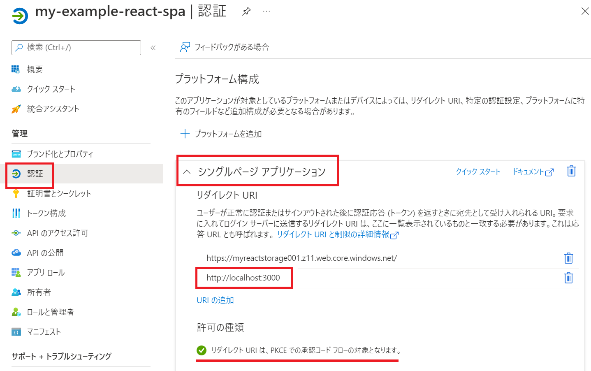
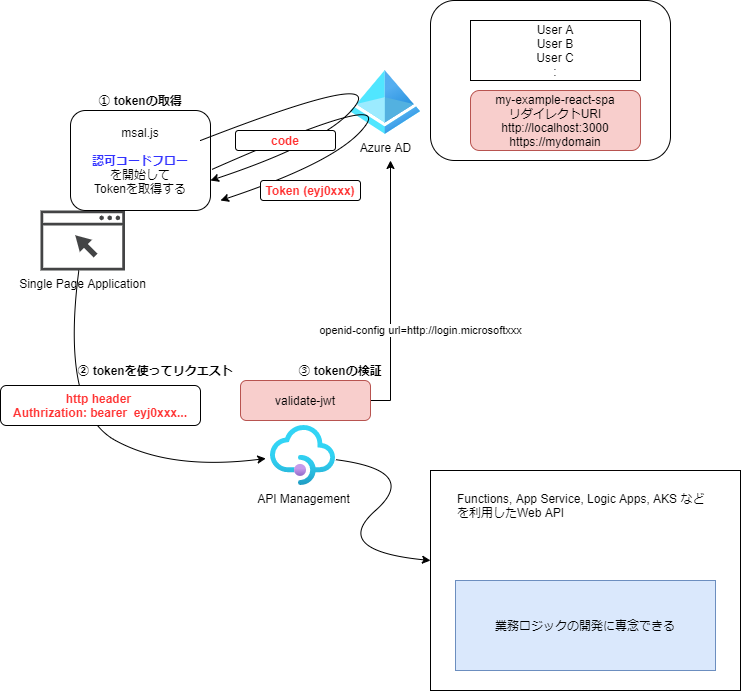

# azure ad + msal.js(react)

https://docs.microsoft.com/ja-jp/azure/active-directory/develop/tutorial-v2-react#get-the-completed-code-sample

(PKCE と CORS を使用した承認コード フロー)
※ PKCE（Proof Key for Code Exchange）とは、認可コード横取り攻撃への対策を目的とし、RFC7636 で定義されているOAuth2.0拡張仕様。

1. サンプル(ms-identity-javascript-react-spa)を動かしながら理解する
2. サンプル(ms-identity-javascript-react-spa)に少し変更を加えてみる

## AADでアプリ登録 (my-example-react-spa)

アプリ登録とはAzure AD に アプリ用のサービスプリンシパルを登録すること。今回の場合はSPA用のサービスプリンシパルを作成してAzureADへログインできるようにします。

・my-example-react-spaを登録する  
・scopeを設定しておく

「認証」はシングルページアプリケーションとして登録し、リダイレクトURI に http://localhost:3000 を設定します。
　


※マニフェストで "accessTokenAcceptedVersion": 2 を指定

## jwtトークンの確認について (https://jwt.io/)

取得したToken（以下はアクセストークン）はDecodeして内容を確認してみる。
```
{
  "aud": "api://8448ce9f-6978-48b5-94c9-042e67bb8048",　★ClientIDが確認できます。★
  "iss": "https://sts.windows.net/xxxxx-xxxx-xxxx-xxxx-123123123123/",
  "iat": 1659925300,
  "nbf": 1659925300,
  "exp": 1659930624,
  "acr": "1",
  "aio": "xxxxx",
  "amr": [
    "pwd"
  ],
  "appid": "12341234-1234-48b5-1233-123123123",
  "appidacr": "0",
  "ipaddr": "14.132.153.117",
  "name": "TEST TEST",
  "oid": "xxxx",
  "rh": "0.xxxx.",
  "scp": "test test2", ★loginRequestで要求したScopeが確認できます★
  "sub": "xxx",
  "tid": "xxx-xx-xx-xx-xx",
  "unique_name": "test@mail.co.jp",
  "upn": "test@mail.co.jp",
  "uti": "xxx",
  "ver": "1.0"d
}
```

## (認可コードフロー) API Managementと連携させてTokenを検証する



テスト用のfunctionを用意する
```
# Storage と FunctionApp
az storage account create -n funcstorage0001 -g az-react-example -l japaneast --sku Standard_LRS --kind StorageV2
az functionapp create -g az-react-example --consumption-plan-location japaneast --runtime node --runtime-version 14 --functions-version 4 --name my-example-test-func --storage-account funcstorage0001 

# apiをデプロイ
func azure functionapp publish my-example-test-func --publish-local-settings -y
# ScaleLimit=1
az resource update --resource-type Microsoft.Web/sites -g az-react-example -n my-example-test-func/config/web --set properties.functionAppScaleLimit=1

# curlで確認
curl https://my-example-test-func.azurewebsites.net/api/hello 
hello, im working...
```

API ManagementにFunctionsをインポートする
```
# 確認
curl https://my-example-apim.azure-api.net/hello
hello, im working...
```

api の inbound設定例 (jwt validation　と cors) 
```
    <inbound>
        <validate-jwt header-name="Authorization" failed-validation-httpcode="401" failed-validation-error-message="Unauthorized. Access token is missing or invalid.(test)">
            <openid-config url="https://login.microsoftonline.com/<tenat-id>/v2.0/.well-known/openid-configuration" />
            <required-claims>
                <claim name="aud">
                    <value> [client id] </value>
                </claim>
            </required-claims>
        </validate-jwt>
        <cors allow-credentials="false">
            <allowed-origins>
                <origin>*</origin>
            </allowed-origins>
            <allowed-methods>
                <method>*</method>
            </allowed-methods>
            <allowed-headers>
                <header>*</header>
            </allowed-headers>
        </cors>
        <base />
    </inbound>
```
(例) scopeが全部一致した場合の指定
```
                <claim name="scp" match="all">
                    <value>test test2</value>
                </claim>
```
(例) scopeの一部一致した場合の指定
```
                <claim name="scp" match="any">
                    <value>test</value>
                    <value>test2</value>
                    <value>test test2</value>
                </claim>
```
## tokenの確認

curlコマンド
```
curl https://my-example-apim.azure-api.net/hello -H 'authorization: Bearer eyJ0eXAxxxxx'
hello, im working...
```

サンプルアプリを少し修正して確認 (axiosを入れてAPIを呼び出す)
```
```

# まとめ

https://myreactstorage001.z11.web.core.windows.net/

Azure Active Directoryでの OAuth2.0 の動作が確認できました。()
SPAを利用したときに利用できる

今回のフローRFCで定義されている 4.1. Authorization Code Grant のフローになります。 MSAL.jsライブラリを利用することで工数をかけずに実現できることがわかりました。

4.1. Authorization Code Grantのフロー
```
     +----------+
     | Resource |
     |   Owner  |
     |          |
     +----------+
          ^
          |
         (B)
     +----|-----+          Client Identifier      +---------------+
     |         -+----(A)-- & Redirection URI ---->|               |
     |  User-   |                                 | Authorization |
     |  Agent  -+----(B)-- User authenticates --->|     Server    |
     |          |                                 |               |
     |         -+----(C)-- Authorization Code ---<|               |
     +-|----|---+                                 +---------------+
       |    |                                         ^      v
      (A)  (C)                                        |      |
       |    |                                         |      |
       ^    v                                         |      |
     +---------+                                      |      |
     |         |>---(D)-- Authorization Code ---------'      |
     |  Client |          & Redirection URI                  |
     |         |                                             |
     |         |<---(E)----- Access Token -------------------'
     +---------+       (w/ Optional Refresh Token)
        
```