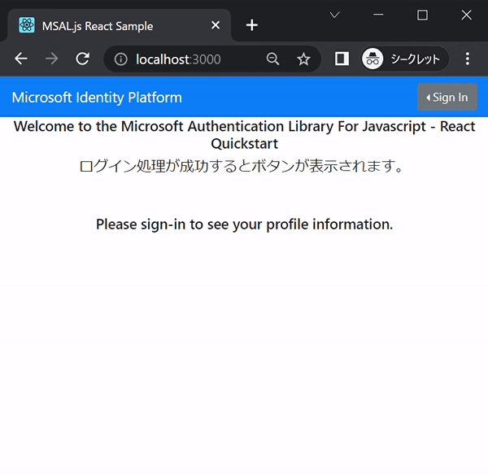
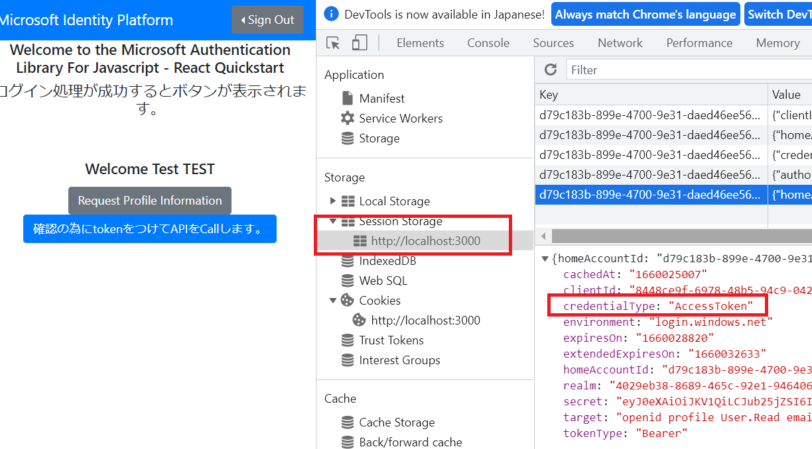
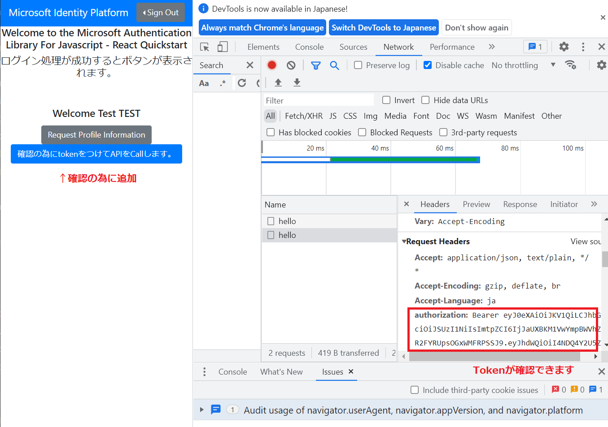

# azure ad + msal.js(react)

Azureでの認証・認可について、Azure Active Directory(AAD) を使った「認可コードフロー」の実装を検証しました。

目的は「認証・認可の処理をバックエンド処理から切り離す」ことで、以下を実現します。  
・バックエンド側の開発は業務ロジックに専念することができるようになる
・認証・認可の処理を一元管理できる


(処理内容)
① Single Page Application(SPA) は MSAL.js を利用して認可コードフローを使ってTokenを取得する
② SPA は取得したTokenをヘッダーに設定してAPI Managementへリクエストを要求する
③ API Management は Token を検証しバックエンドにリクエストを通す

今回検証した内容を図で表すと下記のようになります。


## AADでアプリ登録 (my-example-react-spa)

まずは検証で利用するアプリ(SPA)をAADのアプリ登録から登録します。
アプリ登録とはAzure AD に アプリ用のサービスプリンシパルを登録すること。今回の場合はアプリ登録後にSPA用のサービスプリンシパルが作成されてAzureADへログインできるようになります。

(登録内容)
・scopeを設定しておく
・「認証」はシングルページアプリケーションとして登録し、リダイレクトURI に http://localhost:3000 を設定
※ my-example-react-spaという名前で登録しました。　
※マニフェストで "accessTokenAcceptedVersion": 2 を指定


## 検証に利用したアプリ (ms-identity-javascript-react-spa)
このチュートリアルで公開しているコードサンプルを利用します。
https://docs.microsoft.com/ja-jp/azure/active-directory/develop/tutorial-v2-react

(PKCE と CORS を使用した承認コード フロー)
※ PKCE（Proof Key for Code Exchange）とは、認可コード横取り攻撃への対策を目的とし、RFC7636 で定義されているOAuth2.0拡張仕様。

サンプル(ms-identity-javascript-react-spa)は設定を変更するだけで簡単に利用できるようなっています。ログインに成功すると以下のように「Request Profile Information」というボタンが表示されます。


デフォルトではブラウザの session storage に token が入っていることが確認できます。


● 設定変更について(src/authConfig.js)
以下でログイン時に要求する scope を指定します。
```
:
export const loginRequest = {
    //scopes: ["User.Read"]    ★デフォルトの MS Graph の Scope
    scopes: [
        "api://xxxxxxxx-xxxx-xxxx-xxxx-xxxxxxxxxx/myscope1", ★アプリ登録で作成したScopeを指定
:
```

## jwtトークンの確認について (https://jwt.io/)
検証作業中にTokenの内容を確認したくなった場合は、`https://jwt.io/` で token をDecodeして内容を確認しすることができます。
```
{
  "aud": "api://xxxxxx-xxxx-xxxxx-xxxx-xxxxxxxxxx",　★ClientIDが確認できます。★
  "iss": "https://sts.windows.net/xxxxx-xxxx-xxxx-xxxx-123123123123/",
  "iat": 1659925300,
  "nbf": 1659925300,
  "exp": 1659930624,
  "acr": "1",
  "aio": "xxxxx",
  "amr": [
    "pwd"
  ],
  "appid": "12341234-1234-48b5-1233-123123123",
  "appidacr": "0",
  "ipaddr": "14.132.153.117",
  "name": "TEST TEST",
  "oid": "xxxx",
  "rh": "0.xxxx.",
  "scp": "test test2", ★loginRequestで要求したScopeが確認できます★
  "sub": "xxx",
  "tid": "xxx-xx-xx-xx-xx",
  "unique_name": "test@mail.co.jp",
  "upn": "test@mail.co.jp",
  "uti": "xxx",
  "ver": "1.0"d
}
```

## API Managementと連携させてTokenを検証する

今回はテスト用にfunction(http trigger)を用意し、API Management で token の validation を行います。
細かい手順は省略しますが、図にしておきます。


api management の inbound 設定で cors, validation-jwt を追加します。
```
    <inbound>
        <validate-jwt header-name="Authorization" failed-validation-httpcode="401" 
            failed-validation-error-message="Unauthorized. Access token is missing or invalid.(test)">
            <openid-config url="https://login.microsoftonline.com/<tenat-id>/v2.0/.well-known/openid-configuration" />
            <required-claims>
                <claim name="aud">
                    <value> [client id] </value>
                </claim>
            </required-claims>
        </validate-jwt>
        <cors allow-credentials="false">
            <allowed-origins>
                <origin>*</origin>
            </allowed-origins>
            <allowed-methods>
                <method>*</method>
            </allowed-methods>
            <allowed-headers>
                <header>*</header>
            </allowed-headers>
        </cors>
        <base />
    </inbound>
```

(補足) scopeを検証したい場合は以下のように設定することができます。
(例) scopeが全部一致した場合の指定
```
                <claim name="scp" match="all">
                    <value>test test2</value>
                </claim>
```
(例) scopeの一部一致した場合の指定
```
                <claim name="scp" match="any">
                    <value>test</value>
                    <value>test2</value>
                    <value>test test2</value>
                </claim>
```
※ 検証する項目は自由に変更可能です。

## 確認
※ サンプルアプリケーションにボタンを一つ追加して、ボタンが押されたときにAPIを呼び出すように修正しています。

ローカルでSPAを起動 (npm start) してブラウザで確認します。


ブラウザで確認したTokenを取り出してcurlコマンドでも実行可能です。
```
curl https://my-example-apim.azure-api.net/hello -H 'authorization: Bearer eyJ0eXAxxxxx'
hello, im working...
```

# まとめ

今回検証した内容は RFC 6749 で定義されている 「4.1. Authorization Code Grant のフロー」の実装になります。 
4.1. Authorization Code Grantのフロー
```
     +----------+
     | Resource |
     |   Owner  |
     |          |
     +----------+
          ^
          |
         (B)
     +----|-----+          Client Identifier      +---------------+
     |         -+----(A)-- & Redirection URI ---->|               |
     |  User-   |                                 | Authorization |
     |  Agent  -+----(B)-- User authenticates --->|     Server    |
     |          |                                 |               |
     |         -+----(C)-- Authorization Code ---<|               |
     +-|----|---+                                 +---------------+
       |    |                                         ^      v
      (A)  (C)                                        |      |
       |    |                                         |      |
       ^    v                                         |      |
     +---------+                                      |      |
     |         |>---(D)-- Authorization Code ---------'      |
     |  Client |          & Redirection URI                  |
     |         |                                             |
     |         |<---(E)----- Access Token -------------------'
     +---------+       (w/ Optional Refresh Token)
        
```
Azure Active Directory と MSAL.jsライブラリ を利用することで工数をかけずに実現できることがわかりました。
RFC 6749 (https://tex2e.github.io/rfc-translater/html/rfc6749.html)に書かれている内容を確認しながら進めましたが正直なかなか理解に苦しむことが多かったです。認証・認可はシステムの重要な部分なので学習を継続したいと思います。


# 以下はメモです。

```
# Storage と FunctionApp
az storage account create -n funcstorage0001 -g az-react-example -l japaneast --sku Standard_LRS --kind StorageV2
az functionapp create -g az-react-example --consumption-plan-location japaneast --runtime node --runtime-version 14 --functions-version 4 --name my-example-test-func --storage-account funcstorage0001 

# apiをデプロイ
func azure functionapp publish my-example-test-func --publish-local-settings -y
# ScaleLimit=1
az resource update --resource-type Microsoft.Web/sites -g az-react-example -n my-example-test-func/config/web --set properties.functionAppScaleLimit=1

# curlで確認
curl https://my-example-test-func.azurewebsites.net/api/hello 
hello, im working...
```

API ManagementにFunctionsをインポートする
```
# 確認
curl https://my-example-apim.azure-api.net/hello
hello, im working...
```

https://myreactstorage001.z11.web.core.windows.net/