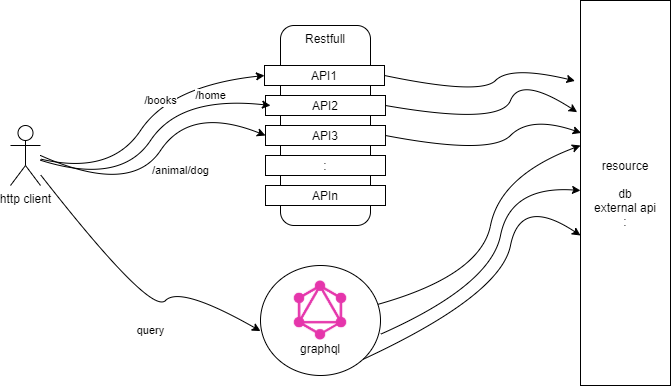
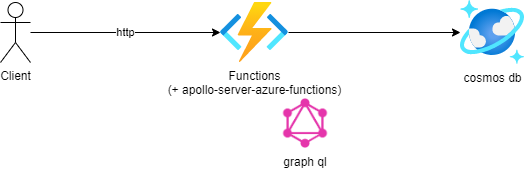
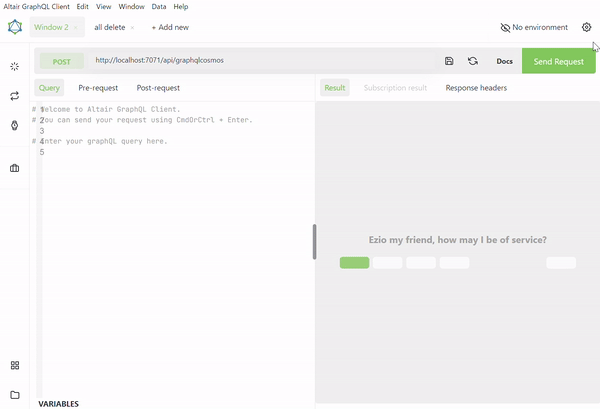

# graphql on azure

AzureでGraphQLの動作の検証を行ったので備忘録としてブログにしておきます。

# (簡単に) GraphQL とは
Facebookが開発したAPIで主な特徴としては
・クライアント側で取得するデータを選択することが可能  
・スキーマ定義を利用するのでデータの不一致を防げる


RESTFull API と良く比較されます。下の図のようにRestFull APIがパスでリソースを指定するのに対してGraphQLでは1つのエンドポイントにクエリを発行するのが大きな違いになります。


# Azure で Graph QL(Cosmos DB) を利用する
(Azureでの構成)


## Azureリソースの準備

cosmos db と functions (typescript + apollo)　を用意します。

```
az group create -n az-graphql-example -l japaneast
#az group delete -n az-graphql-example
```

### cosmos db
account,db,containerを作成
```
# account
az cosmosdb create --name example01cosmosaccount --resource-group az-graphql-example
# db
az cosmosdb sql database create -a example01cosmosaccount -g az-graphql-example -n my-test-db
# container
az cosmosdb sql container create -a example01cosmosaccount -g az-graphql-example -d my-test-db -n my-container1 -p /modelType --throughput 400
```
※地理空間データにも対応しています。

### functions (Option)
※ functionsはローカルで実行もできるので必須ではありません。
```
az storage account create -n funcstorage0002 -g az-graphql-example -l japaneast --sku Standard_LRS --kind StorageV2
az functionapp create -g az-graphql-example --consumption-plan-location japaneast --runtime node --runtime-version 14 --functions-version 4 --name my-example-graphql-func --storage-account funcstorage0002 
```

functionsの準備ができたらfunctionsAppのデプロイします。
```
func azure functionapp publish my-example-graphql-func --publish-local-settings -y
```

# azure functions コーディング 

Microsoftのドキュメントとサンプルソースを参考に実装を行いました。
[GraphQL HelloWorld](https://docs.microsoft.com/ja-jp/azure/developer/javascript/how-to/with-web-app/graphql/azure-function-hello-world?tabs=visualstudiocode)
[GraphQL CRUD API](https://docs.microsoft.com/ja-jp/azure/developer/javascript/how-to/with-web-app/graphql/azure-function-crud-mutation?tabs=visualstudiocode)
[GraphQL Static Web](https://docs.microsoft.com/ja-jp/azure/developer/javascript/how-to/with-web-app/graphql/static-web-app-graphql/introduction)

(参考にしたサンプルソース)
[helloworld](https://github.com/Azure-Samples/js-e2e-azure-function-graphql-hello), [crud](https://github.com/Azure-Samples/js-e2e-azure-function-graphql-crud-operations.git), [Static Web](https://github.com/Azure-Samples/js-e2e-graphql-cosmosdb-static-web-app)

環境
```
node -v
v14.18.2
func -v
4.0.4544
```

追加ライブラリ(package.json)
```
:
  "dependencies": {
    "@azure/cosmos": "^3.16.4",
    "apollo-server-azure-functions": "^3.10.0",
    "graphql": "^16.5.0",
    "uuid": "^8.3.2"
  },
  "devDependencies": {
    "@azure/functions": "^3.0.0",
    "typescript": "^4.0.0"
  }
:
```

## Function作成

主に必要な作業は以下の3点になります。
1. graphql用 に"Http Trigger"関数を作成し ApolloServerを組み込む
1. スキーマ定義ファイルを作成
1. リゾルバーの実装(データソースに対する処理(今回はcosmos db))

### 関数の作成 (cosmos db用のgraphql api)

※ 名前をgraphqlcosmosとして作成しています。

```
func init --typescript my-graphql-fun
func new --template "Http Trigger" --name graphqlcosmos
```

function.json の outpuバインディングを以下のように変更
```
{
  "bindings": [
    {
      "authLevel": "function",
      "type": "httpTrigger",
      "direction": "in",
      "name": "req",
      "methods": [
        "get",
        "post"
      ]
    },
    {
      "type": "http",
      "direction": "out",
      "name": "$return" ★変更
    }
  ],
  "scriptFile": "../dist/graphqlcosmos/index.js"
}
```

index.tsの内容は以下のように単純にApolloServerを作成するだけの処理になります。
```
import { AzureFunction, Context, HttpRequest } from "@azure/functions"
import { ApolloServer } from "apollo-server-azure-functions"

import { typeDefs } from "./data/typeDefs";
import resolvers from "./data/resolvers";

// ApolloServerを作成
const server = new ApolloServer({ 
    typeDefs, 
    resolvers
});

export default server.createHandler();
```

### スキーマ定義の作成 (typeDefs.ts)
すべて書くと長くなってしまうので省略して記載します。
```
export const typeDefs = gql`
    input inpurtRecord {} 
    input inputRecordDetail {}
    type Result {} 
    type Record {}
    type RecordDetail {}
    type Query {　※Queryとして４つ定義しました。
        helloWorld: String!
        getAll(maxRecord: Int): [Record]! ※すべてのレコードを取得
        getByUserId(userId: String): [Record]! ※IDを指定して1件取得
        getDetailByUserId(userId: String): [RecordDetail]!
    }
    type Mutation { ※CRUD操作確認用に作成 
        allPurge: Result ※すべてのレコードを削除する(確認用)
        createRecord(input: inpurtRecord): Record
        updateRecord(input: inpurtRecord): Record
        deleteRecord(input: inpurtRecord): Record
        createRecordDetail(input: inputRecordDetail): RecordDetail
    }
:
`;
```

### リゾルバーの実装 (resolver.ts)
実際にCosmosDBへアクセスしてデータを操作する処理を実装します。
今回はこのリゾルバの中でCosmosDBへのアクセス処理を含めています。
```
export const resolvers = {
    Mutation: { ... }
    Query: { ... }
}
```

ファイル構成は以下のようにしました。
```
tree -L 
.
├── graphqlcosmos ★今回追加した関数
│   ├── data
│   │   ├── resolvers.ts ★リゾルバの実装
│   │   ├── typeDefs.ts　★スキーマ定義
│   │   └── types.ts　★データモデル
│   ├── function.json
│   └── index.ts ★functions で ApolloServerを設定
├── host.json
├── local.settings.json
├── node_modules
├── package-lock.json
├── package.json
└── tsconfig.json
```

それでは以降で実際に動作確認して行きます(func start)。

## 確認はGUIツール(altair.sirmuel.design)を利用
cURLコマンドで以下のようにも確認できますが、少し複雑なクエリを書こうとすると文字列のエスケープなどで分かりにくくなってしまうので今回はGUIのツールをインストールして利用します。

### https://altair.sirmuel.design/ をインストール
altair_4.6.2_x64_win.exe をダウンロードしてインストールします。

GUIツールでは主に以下が可能です。  
・(画面右)ドキュメントの確認  
・(画面中央)クエリの結果の確認  
・(画面左)クエリの発行  
以下の動画のようにドキュメントからクエリを作成・発行して結果を確認することができます。

データの作成(C)、取得(R)、更新(U)、削除(D)ができることを確認でき作成されたデータはCosmosDBでも確認できます。

## クエリの例
クエリの例を記載しておきます。

### Read (全件取得)
```
query {
  getAll{
    userId 
  }
}
```

### Create (新規に1件作成)
```
mutation{
  createRecord(input:{
    description: "new create"
  }){id}
}
```

### Update (idを指定して1件更新)
```
mutation{
  updateRecord(input:{
    id: "e31227b1-4790-4142-9459-0686a19bb929",
    userId: "JohnDoe",
    description: "update description"
  }){id}
}
```

### Delete (idを指定して1件削除)
```
mutation{
  deleteRecord(input:{
    id: "e31227b1-4790-4142-9459-0686a19bb929"
  }){id}
}
```

すべて削除（確認用）
```
mutation {
  allPurge {
    message
  }
}
```

# まとめ
Azureでは Azure Functions を利用することで簡単に GraphQL を始められるようになっていることが分かりました。
今回はCosmosDBを利用しましたがもちろんRDBや外部のAPIを連携することも可能です。
クライアント側の実装は楽になりそうですが、その分バックエンド側の開発の負担が増える傾向にあると思います。
[GitHub が GraphQL API](https://docs.github.com/ja/graphql) として公開しているようにデータの公開などに適していると思います。

Azure Functions を利用して GraphQL を初めてみては如何でしょうか。

