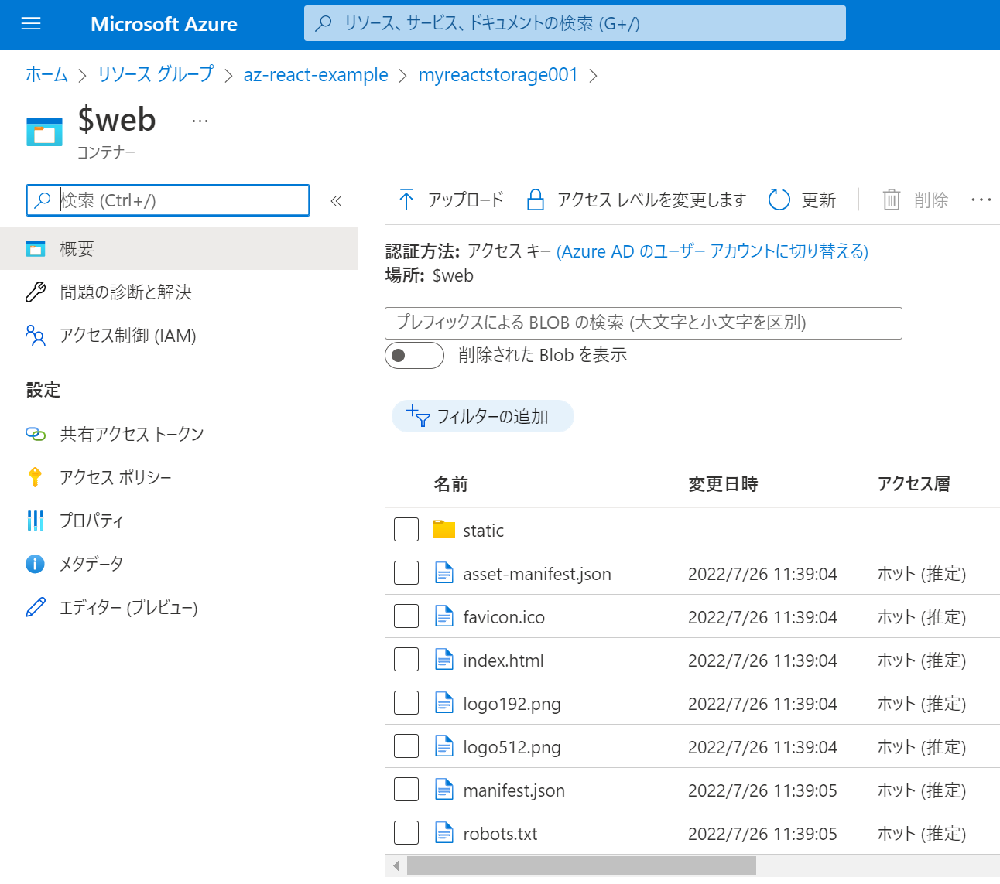

# react-learn


reactのはじめます。※期間の目安は2-3週間くらい

前提：javascript, vue, angular, css, html 少しわかる人

# 環境
## version
```
node -v
v14.18.2
npm -v
6.14.15
npx -v 
6.14.15
```

npm : パッケージ管理ツール  
npx : パッケージランナーツール (インストールしていないNodeパッケージもターミナルで実行可能)  

windowsの方が動作が軽いのでwindowsで作業しています。
typescriptで実施

## プロジェクトの作成・開始

### JavaScript
```
npx create-react-app my-app
```

### TypeScript
```
npx create-react-app my-app --template typescript
```

### ローカル実行とビルド
```
npm start
npm run build
```

## version(package.json)
```
:
    "react": "^18.2.0",
    "typescript": "^4.7.4",
:
```

## Azure Storageへデプロイ

azureリソースの作成
```
az group create -n az-react-example -l japaneast
az storage account create -n myreactstorage001 -g az-react-example -l japaneast --sku Standard_LRS

# 静的な Web サイトのホスティングを有効
az storage blob service-properties update --account-name myreactstorage001 --static-website --404-document 404.html --index-document index.html
```

ビルドしてコンテンツを$webへUpload
```
# ビルド
npm run build

# $webへUpload
az storage blob upload-batch -s ./build -d $web --account-name myreactstorage001 --overwrite
```

urlを取得
```
az storage account show -n myreactstorage001 -g az-react-example --query "primaryEndpoints.web" --output tsv
```
ブラウザでアクセスして確認  

storage の $web にファイルが確認できます。


## chrome の拡張

chromeの拡張を入れておくとComponentの内容が確認できます。


## vs code の拡張 (おすすめ)


## (余談) N--t.js 名前が似ているフレームワーク 

### Next.js
Reactをベースに開発されたJavaScriptフレームワーク  
Reactが Viewライブラリ なのに対して、サーバーとして動かすことが可能  
SSR(サーバーサイドレンダリング)を行う為に利用  

### Nest.js
Node.jsサーバーサイドアプリケーション  
内部的にはDefaultでExpressを利用している。※Fastifyに変更可能  

### Nuxt.js (ナクスト)
これは Vue のフレームワーク  
SSR(サーバーサイドレンダリング)を行う為に利用
